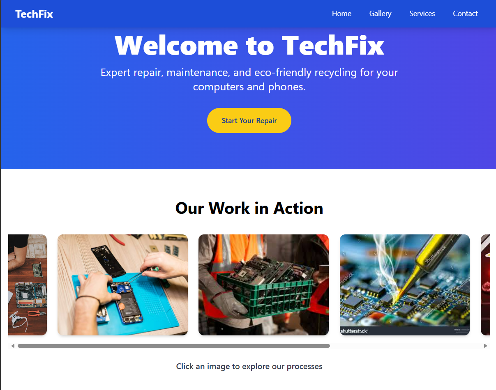

# TechFix - Hardware Maintenance & Recycling Website



## 📖 Overview

TechFix is a modern, responsive website built for a JavaScript-focused assignment, showcasing a professional landing page for a **Computer and Phone Hardware Maintenance and Recycling** service. The website demonstrates advanced **JavaScript event handling**, **interactive elements**, and **form validation**, creating an engaging user experience with a clean, accessible design.

The site features a sticky navigation bar, a dynamic hero section, an interactive image gallery, enhanced service tabs with visuals, a validated contact form, and a detailed footer. It’s built with **HTML**, **CSS (via Tailwind CSS)**, and **JavaScript**, ensuring responsiveness and interactivity across devices.

## 🚀 Features

### 1. Event Handling
- **Button Clicks**: Hero CTA button updates text and color on click, with a click counter.
- **Hover Effects**: Buttons and gallery images scale and transform on hover.
- **Keypress Detection**: Pressing Enter triggers the CTA button for accessibility.
- **Double-Click Easter Egg**: Double-clicking the CTA reveals a discount code alert.

### 2. Interactive Elements
- **Sticky Navigation**: Fixed header with smooth scrolling to sections (Home, Gallery, Services, Contact).
- **Image Gallery**: Clickable images update captions and highlight selections with borders.
- **Service Tabs**: Detailed tabs for Repair, Recycling, and Diagnostics, featuring images, descriptions, and smooth transitions.
- **Animations**: CSS transitions for gallery images, tabs, and buttons enhance UX.

### 3. Form Validation
- **Real-Time Feedback**: Validates name, email, and password as users type.
- **Rules**:
  - Name: Required, non-empty.
  - Email: Valid format using regex.
  - Password: Minimum 8 characters.
- **Submission**: Displays success message and resets form on valid input.

### 4. Design & Accessibility
- **Responsive Layout**: Adapts to mobile and desktop using Tailwind CSS.
- **SEO & Social Sharing**: Comprehensive meta tags (Open Graph, Twitter Cards).
- **Accessibility**: Semantic HTML, keyboard navigation, and clear form feedback.
- **Modern Aesthetics**: Gradient hero, cohesive blue-yellow-gray palette, and smooth animations.

## 📂 Project Structure
📂 techfix-website/ 
├── index.html # Main HTML structure 
├── style.css # Custom CSS for animations and styles 
├── script.js # JavaScript for interactivity and validation 
└── README.md # Project documentation


## 🛠️ Setup Instructions

### Prerequisites
- A modern web browser (e.g., Chrome, Firefox).
- No additional software required (Tailwind CSS is loaded via CDN).

### Steps
1. **Clone or Download**:
   - Clone the repository or download the project files.
   ```bash
   git clone <repository-url>

   Navigate to Project: cd techfix-website
Open the Website:

Open index.html in a browser (e.g., double-click or use a local server).
Example with a simple server:
python -m http.server 8000
Visit http://localhost:8000.

## Test Interactivity:
Click the CTA button, navigate via the header, interact with the gallery, switch tabs, and submit the contact form.
Test responsiveness by resizing the browser or using mobile view in developer tools.

# 🎨 Customization
Images: Replace placeholder URLs (e.g., img/https://via.placeholder.com) with real images in index.html.
Styling: Modify style.css or Tailwind classes in index.html for custom colors or layouts.
JavaScript: Extend script.js to add more interactivity (e.g., new events or form fields).
Content: Update text in index.html to reflect specific services or branding.

# 🔍 Testing
Event Handling: Verify button clicks, hovers, keypresses, and double-click easter egg.
Interactivity: Test gallery clicks, tab switching, and smooth scrolling.
Form Validation: Submit the form with valid and invalid inputs to check real-time feedback.
Responsiveness: View on mobile, tablet, and desktop sizes.
Accessibility: Navigate using keyboard (Tab, Enter) and verify screen reader compatibility.

## 📝 Notes

Placeholder Images: Replace via.placeholder.com URLs with actual images for production.
Local Testing: Use a local server for best results, as some browsers restrict file:// protocols.
Assignment Compliance: Meets all requirements for JavaScript event handling, interactive elements, and form validation, with bonus features like animations and a double-click secret.

## 🙌 Contributing

Contributions are welcome! To contribute:
Fork the repository.

Create a feature branch (git checkout -b feature-name).
Commit changes (git commit -m "Add feature").

Push to the branch (git push origin feature-name).
Open a pull request.

## 📜 License
This project is licensed under the MIT License. See LICENSE for details.

# 📬 Contact
For questions or feedback:
Email: support@techfix.com
Project Issues: GitHub Issues

### Built with 💻 by Lucky Nakola for the JavaScript Event Handling Assignment, 2025.